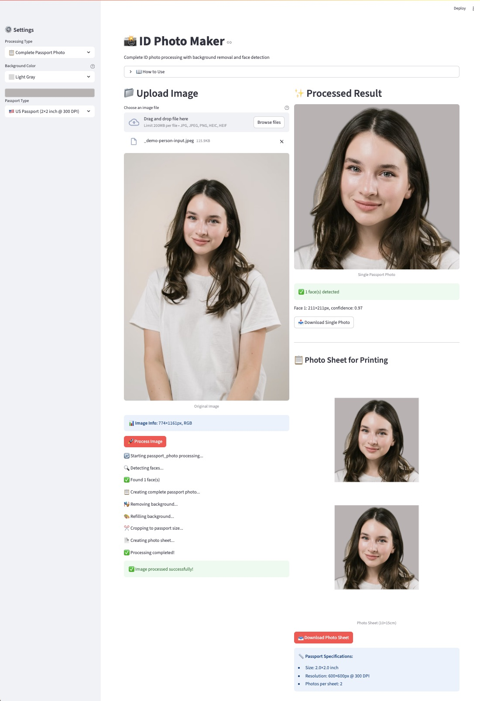
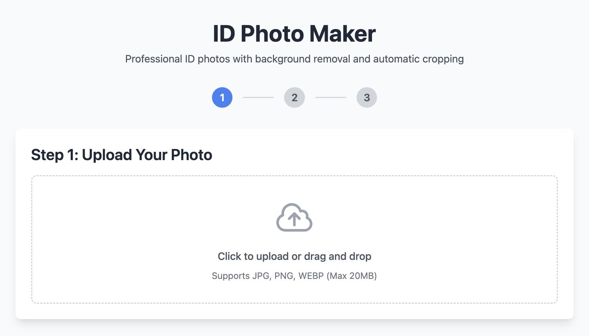
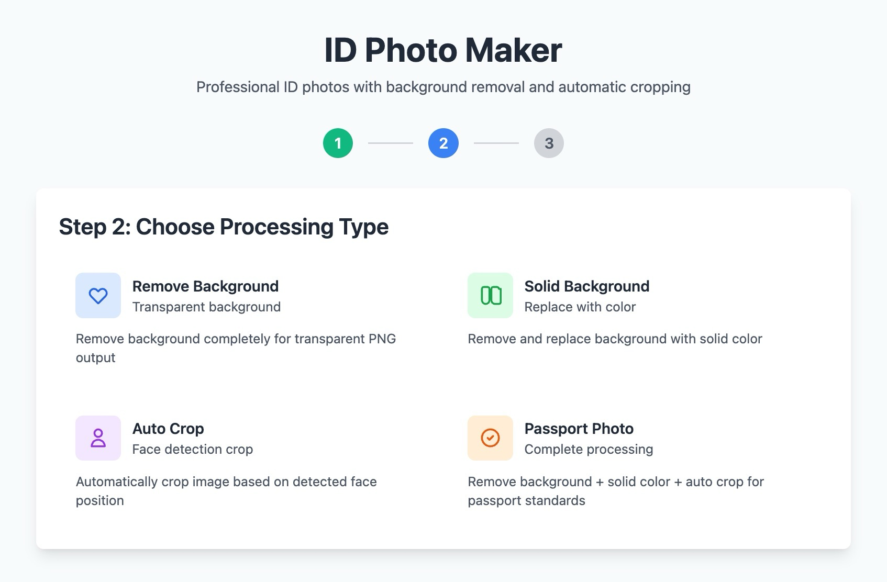
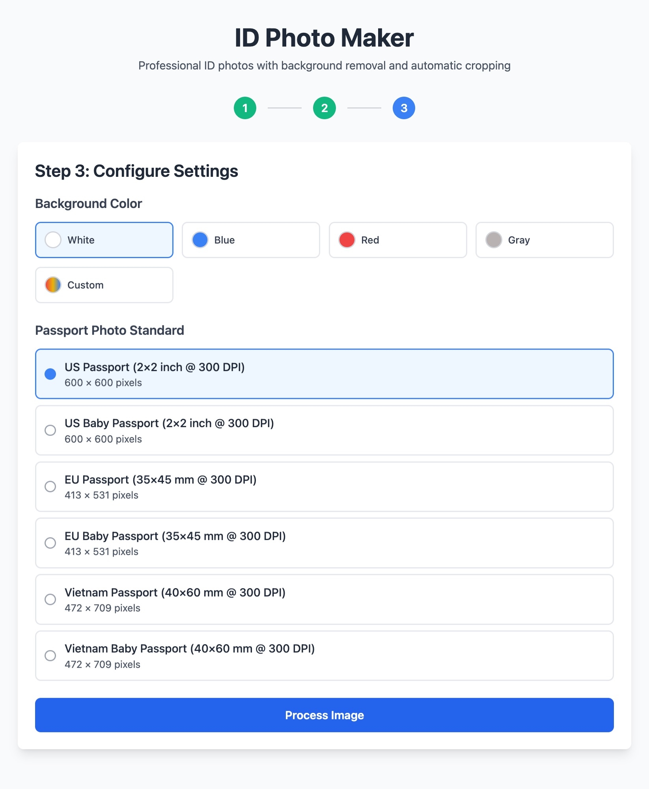
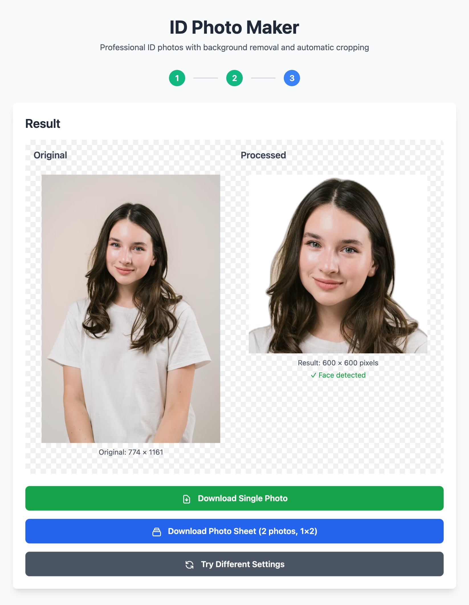
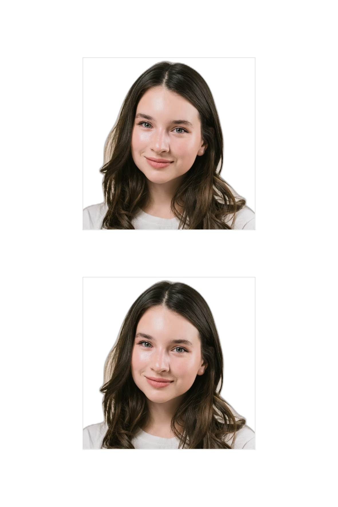

# ID Photo Maker

Ref: 
- https://github.com/GavinMorganField/id-photo-maker
- https://bgremover.streamlit.app

## Demo 2: ML app in Streamlit

URL: https://id-photo.streamlit.app

_Screenshots:_

<kbd></kbd>

## Demo 1: Webapp in Vercel

URL: https://abc-id-photo.vercel.app

> Status: Failed. `Error: Size of uploaded file exceeds 300MB`

_Screenshots:_

<kbd></kbd>

<kbd></kbd>

<kbd></kbd>

<kbd></kbd>

<kbd></kbd>

### Running Locally

```bash
npm i -g vercel
vercel dev
```

Your application is now available at `http://localhost:3000`.

### Docs

- Vercel's Serverless Functions using the [Python Runtime](https://vercel.com/docs/concepts/functions/serverless-functions/runtimes/python).
- Deploy the example using [Vercel](https://vercel.com?utm_source=github&utm_medium=readme&utm_campaign=vercel-examples).
